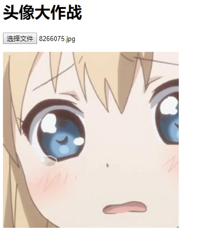
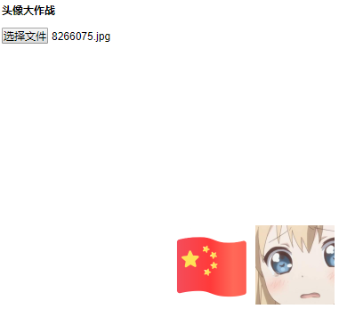
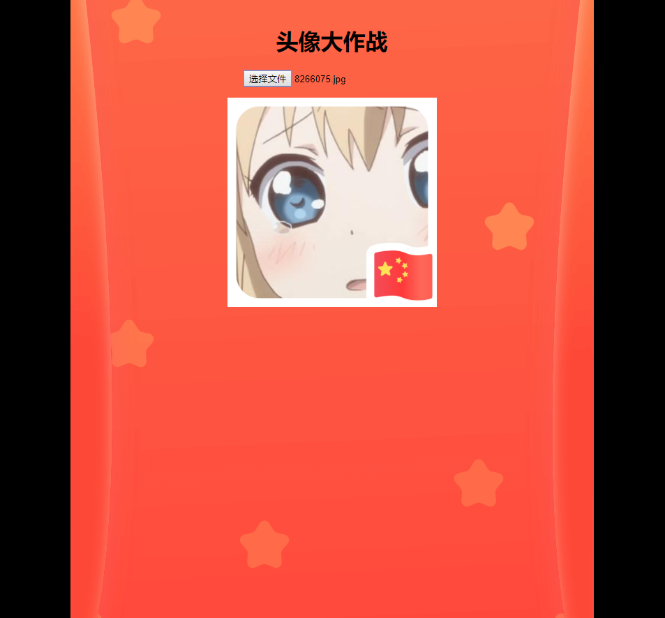
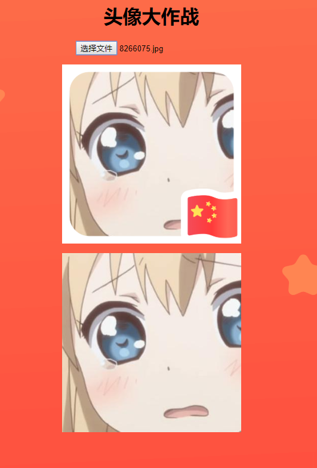
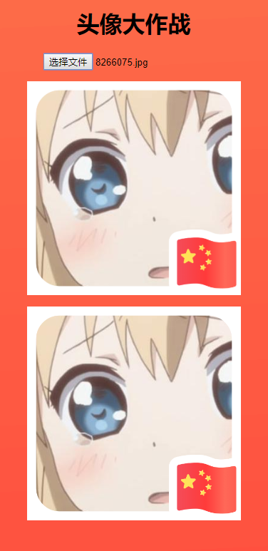
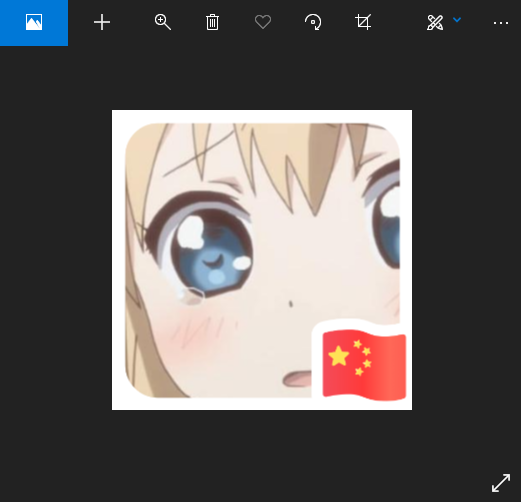
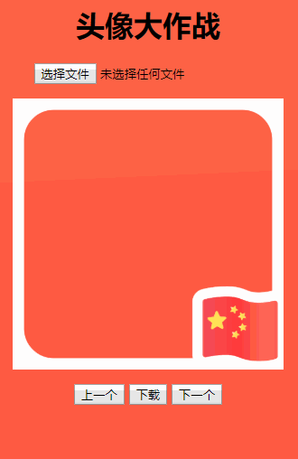

# 迎国庆！头像大作战！

今天我们来手把手教你实现一个超简版国庆头像生成器。

## 头像预览

首先，先写出一个最基本的网页结构：
```html
<!DOCTYPE html>
<html lang="en">
<head>
    <meta charset="UTF-8">
    <meta name="viewport" content="width=device-width, initial-scale=1.0">
    <meta http-equiv="X-UA-Compatible" content="ie=edge">
    <title>头像大作战</title>
    <style>
        /* 这里写网页的样式 */
    </style>
</head>
<body>
    <header><h1>头像大作战</h1></header>
    <article>
        <section>
            <!--这里写我们的生成器代码-->
        </section>
    </article>
    <footer>
        <script>
            // 这里写待会儿的 JavaScript 控制代码
        </script>
    </footer>

</body>
</html>
```

然后，我们要做到可以预览用户选择的头像，我们先来给网页加上一个文件选择控件，和图片标签，标签上加上 `id`，以便后面通过 Javascript 控制。

```html
<p>
    <!--accept 限制了只能选择图片-->
    <input type="file" name="" id="upload" accept="image/*">
</p>
<p id="avatar">
    
</p>
```

接着，我们来写预览图片的代码，借助于 `URL.createObjectURL` 来加载图片。

```javascript
function loadImage() {
    // 载入图片生成 blob 链接
    var imgUrl = window.URL.createObjectURL(document.getElementById('upload').files[0]);
    document.getElementById('avatar_img').src = imgUrl;
}
```

当用户选择图片时，就要载入图片，所以我们把 `loadImage` 绑定在 `upload` 的 `onchange` 事件里面：

```html
<input type="file" name="" id="upload" accept="image/*" onchange="loadImage()">
```

这样选择图片后，图片就会显示出来了。



接着，我们要头像叠加的效果，我已经事先从腾讯的网站把素材爬下来了。可以在这儿下载：https://github.com/szisa/avatar_maker/tree/master/img

我们把图片都存放在 `img` 目录。总共 4 种外框，分别命名为 `head0.png`, `head1.png`, `head2.png`, `head3.png`，另外，还抓多一张 `bg.png` 做背景。

我们先用 `head0.png` 做样式。在头像预览的地方加入一个 `img` 标签，用来显示外框图片。

```html
<p id="avatar">
     <!-- 加入这一句 -->
    
</p>
```

现在网页选了头像是这样的：



这不是我们要的，外框太大，而且也没重叠在一起，这时就要靠 CSS 大法来帮忙了。在 `style` 加入下面代码：

```css
body {
    /* 设置从腾讯新闻偷来的背景图 */
    background: #000 url(./img/bg.png) no-repeat center;
    /* 让所有内容居中 */
    text-align: center;
}
#avatar {
    /* 设置预览的框为 300 px */
    width: 300px;
    height: 300px;
    /* 设置相对定位，用来给 avatar_template 的绝对定位当坐标 */
    position: relative;
    /* 自动调节外边距，使之左右居中 */
    margin: auto;
    /* 超出的内容隐藏 */
    overflow: hidden;
}
#avatar img {
    /* 设置图片的宽度和 avatar 一样 */
    width: 100%;
}

#avatar_template {
    /* 设置外框绝对定位，左上角对齐 */
    position: absolute;
    top: 0;
    right: 0;
}
```

ok，到这里来有几个知识点重点讲解一下，只想赶快做出来的可以略过这部分。

1. margin: auto；  
HTML 元素中，按照默认样式，可以被分为**内联元素**和**块级元素**。**内联元素**可以被 `text-align` 居中，而块级元素，则要靠外边距的的补齐来实现左右居中。   
当设置**块级元素**的 `margin` 为 `auto` 时，浏览器就会自动计算左右外边距，将剩余空间平分到左右外边距，这样就实现了左右居中。

2. position: absolute;  
为了实现把外框覆盖在头像上，我们需要让外框图片脱离正常文档流，而**绝对定位**可以帮我们实现这一点。  
**绝对定位**的定位原点则是通过包含块来决定的。我们需要让外框图片精准对齐 `#avatar` 的左上角，那么就需要让 `#avatar` 成为**绝对定位**的包含块，而只要给 `#avatar` 设置 `position` 且值不等于 `static`，他就会自动成为包含块。当如果设置 `fixed` 或 `absolute`，则会让标签脱离文档流，影响样式，因此，我们就给 `#avatar` 设置了 `position: relative`。

那么现在我们选择头像之后，就会变成这样：



## 头像绘制

现在就要来做保存图片的代码了，我们没办法直接把标签变成图片。但是，我们可以通过`canvas`，依次绘制两张图片，就可以实现图片的叠加了！

首先，我们要给 HTML 里加入一个 `canvas` 标签：
```html
<p>
    <canvas width="300" height="300" id="cvs"></canvas>
</p>
```

然后，就要开始用图片绘制了。定义一个函数 `drawImage`，传入图片地址，绘制图片到画布：

```javascript
function drawImage(img) {
    // 取得 Canvas
    var cvs = document.getElementById('cvs');
    var size = 300;
    // 设定 canvas 宽高
    cvs.width = size;
    cvs.height = size;
    // 取得 2d 画布
    var ctx = cvs.getContext('2d');
    // 新建图片对象，加载图片
    var image = new Image;
    image.src = img;
    image.onload = function() {
        // 加载完成后绘制 image 到(0,0)坐标，长宽重设为 size
        ctx.drawImage(image, 0, 0, size, size);
    }
}
```

然后，当用户选择图片后，我们就要把他画上去，所以在 `loadImage` 最后要加上 `drawImage` ：

```javascript
function loadImage() {
    var imgUrl = window.URL.createObjectURL(document.getElementById('upload').files[0]);
    document.getElementById('avatar_img').src = imgUrl;
    // 绘制用户选择的头像
    drawImage(imgUrl)
}   
```

现在选择头像后，就会变成这样：



接着，我们还得把外框绘制上去，因为后面还要提供更换外框的功能，把外框的地址作为参数传入到 `drawImage` ：
```javascript
function drawImage(img, frame) {
    var cvs = document.getElementById('cvs');
    var size = 300;
    cvs.width = size;
    cvs.height = size;
    var ctx = cvs.getContext('2d');
    var image = new Image;
    image.src = img;
    image.onload = function() {
        ctx.drawImage(image, 0, 0, size, size);
        // 载入外框图片
        image = new Image;
        image.src = frame;
        image.onload = function() {
            // 绘制外框图片
            ctx.drawImage(image, 0, 0, size, size);
        }
    }
}
```

那么调用的地方，就要变成这样：
```javascript
function loadImage() {
    // 载入图片生成 blob 链接
    var imgUrl = window.URL.createObjectURL(document.getElementById('upload').files[0]);
    document.getElementById('avatar_img').src = imgUrl;
    // 再传入 avatar_template 的图片地址
    drawImage(imgUrl, document.getElementById('avatar_template').src)
}   
```

这时候，用户选择头像后，就会变成这样：



这个 `canvas` 只是用来保存，那么可以把他隐藏起来，加上 CSS 样式 `style="display:none"` 在 `canvas` 上。

## 头像保存

接着，我们来做保存的部分。`canvas` 有一个方法 `toDataURL` 用来将内容生成成图片的 **DataURL**。那么我们只要把这个 **DataURL** 作为 `a` 标签的地址，利用 `a` 标签的 `download` 属性，模拟点击即可实现图片下载了。具体代码：

```javascript
function downloadImage() {
    var canvas = document.getElementById('cvs');

    // 导出图片 DataURL
    var image = canvas.toDataURL("image/png")

    // 创建一个 a 标签，设置 download 属性，点击时下载文件
    var save_link = document.createElement('a');
    save_link.href = image;
    save_link.download ='avatar.png';
    
    // 创建 click 模拟事件
    var clickevent = document.createEvent('MouseEvents');
    clickevent.initEvent('click', true, false);
    // 触发点击事件
    save_link.dispatchEvent(clickevent);

}
```

我们创建一个下载按钮用来下载图片，并把`downloadImage`绑定在按钮上

```html
<p>
    <button id="download" onclick="downloadImage()">下载</button>
</p>
```

选择头像，点击下载，浏览器就会下载图片了，最后生成的图片：



你学会了吗？你满足了吗？不！我不满足，我还要做到可以选择不同的外框。那么，让我们继续~

## 外框选择

要切换外框，需要做两件事儿：

1. 换掉预览的 `avatar_template` 的图片地址；
2. 刷新 `canvas`，重新绘制头像；

我们可以通过两个按钮，前后切换头像边框。那么，先加上两个按钮，就放在下载按钮的左右两侧：

```html
<button id="prev">上一个</button>
<button id="download" onclick="downloadImage()">下载</button>
<button id="next">下一个</button>
```

上下切换边框很简单，只要计算边框的地址，然后更新 `avatar_template` 的图片地址就行了。为了节省解析当前切换到哪张边框的功夫，我们把当前边框的 Index 存放在图片的 `alt` 属性。

```javascript
function prevTemplate() {
    // 取出当前边框 Index
    var current = parseInt(document.getElementById('avatar_template').alt);
    // Index - 1，若小于 0 ， 则变成 3
    current = (current - 1 + 4) % 4;
    document.getElementById('avatar_template').src = 'img/head' + current + '.png';
    document.getElementById('avatar_template').alt = current;
    // 重新绘制 canvas
    loadImage();
}

function nextTemplate() {
    var current = parseInt(document.getElementById('avatar_template').alt);
    current = (current + 1) % 4;
    document.getElementById('avatar_template').src = 'img/head' + current + '.png';
    document.getElementById('avatar_template').alt = current;
    loadImage();
}
```

接着，把函数绑定到按钮的 `onclick` 事件上，就大功告成了。

```html
<button id="prev" onclick="prevTemplate()">上一个</button>
<button id="download" onclick="downloadImage()">下载</button>
<button id="next" onclick="nextTemplate()">下一个</button>
```

最后成品（https://szisa.github.io/avatar_maker/sample.html）：



完整代码可以来这看哦：https://github.com/szisa/avatar_maker/blob/master/sample.html

## 后记

认真跟着做到这一步的同学们都很棒哦~细心的同学可能会发现，预览的部分似乎不要也可以，直接使用 Canvas 作为预览不就可以了？事实上，确实是这样的。不过，加多了一个 HTML 的预览，是为了别的头像生成器去特地保留的！

10月来了，12月还会远吗~[斜眼笑]如果把边框换成圣诞帽，是不是就可以用来生成圣诞帽头像了呢！但是圣诞帽可不会固定在一个位置，这就需要给用户自行调整的机会，所以，我们就需要通过 HTML 预览的部分提供给用户交互，因为 `canvas` 几乎没办法做交互。那么到底要怎么实现呢？且听下回分解！